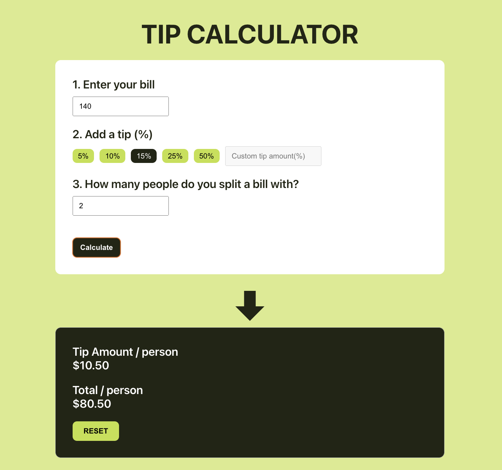

# Tip Calculator
This application enables users to calculate the tip and total payment per person.

## Demo
You can see how it works by visiting [here](https://tip-calcuration.vercel.app/)

## How to use this app?
There are easy three steps to calculate the tip & total amount of payment per person.
1. Enter your bill
2. Add a tip (%)
3. Enter the number of people to split the bill

